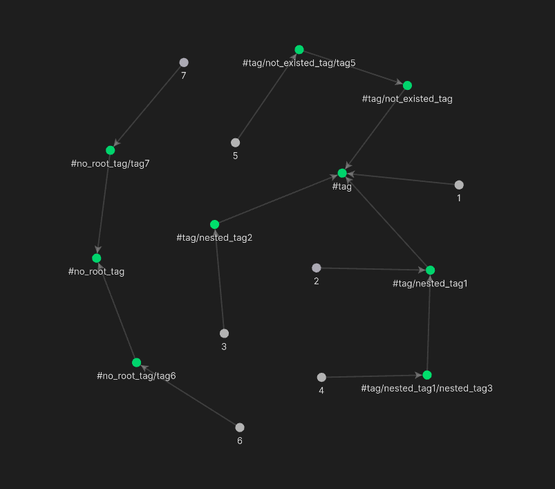

# Obsidian Nested tags graph Plugin

This is a plugin for [Obsidian](https://obsidian.md).

Links nested tags (Sub_tag->Tag) in graph view:

## Usage
1. Install the plugin in obsidian or do it manually
2. Enable the plugin
3. ...
4. Profit!!!

[Original Obsidian forum feature request](https://forum.obsidian.md/t/view-structure-of-nested-tags-on-graph/11386/22)

> Caution! At the moment, there is no Obsidian API for working with the graph. So I did a bit of reverse engineering and found this method. Since this is not part of the public API, I have no confidence that this will work on newer versions.

## Manually installing the plugin

-   Go to releases, copy over `main.js`, `manifest.json` to your vault `VaultFolder/.obsidian/plugins/graph-nested-tags/`.

> **Note**: inspired by code from [folders2graph](https://github.com/ratibus11/folders2graph)
